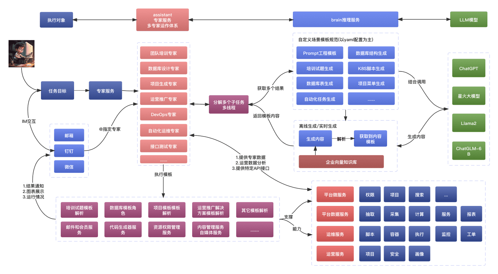

## 概述

运营人员提供一个强大的助手工具，帮助他们监控系统运维状态，并提供状态通报、分析和通知等功能。
Brain服务提供了一组接口用于生成和处理自然语言内容，基于LLM，以解决业务场景中的自然语言处理需求。这些接口包括流式内容响应、实时内容响应和离线内容生成接口。

## 服务交互

服务提供异步与 GPT 进行交互的方式。Brain 生成结果，并根据要求解析后保存到数据库。其中，同步返回结果为流式输出，而异步方式则由 Client 获取并保存结果。

说明:

- [重点]服务之前交互以自定义的yaml格式来进行交互，以达到更高的准确率，数据安全问题，节约Token成本，响应时间等问题
- 每个专家可以执行多个Prompt，assistant使用多任务多线程方式调用返回结果(是否引用工作流？待考虑)
- 执行服务每个服务在`adapter`里面进一步添加模板解析的能力来调用本服务，来进行多方的适配管理(DDD的概念)
- 处理完成之后，数据还有其它统一进入到数据仓库里面，为后期的专家服务提供知识来源，同时也是向量仓数据来源之一(注意是之一)

## 场景能力

- 考试场景: 小学生编程、面试、驾照、内部培训等考试场景
- 大文本场景：技术方案、合同、文档、书籍等场景
- 管理者：团队管理、自动办公、Leader调用WorkerAgent场景

## 鸣谢

- interpreter 部分参考了 [open-interpreter]() 项目的代码和思路。
- 多模型适配部分参考了 [Agents-Flex]() 项目的代码和思路。
- 前端部分集成了 [chatgpt-web](https://github.com/Chanzhaoyu/chatgpt-web)。
- 头像地址从[userpics](https://userpics.craftwork.design/) , 注:此不可商用
- 部分设计参考[FastGPT](https://github.com/labring/FastGPT)
