## 概述

运营人员提供一个强大的助手工具，帮助他们监控系统运维状态，并提供状态通报、分析和通知等功能。
Brain服务提供了一组接口用于生成和处理自然语言内容，基于LLM，以解决业务场景中的自然语言处理需求。这些接口包括流式内容响应、实时内容响应和离线内容生成接口。

## 场景能力

- 考试场景: 小学生编程、面试、驾照、内部培训等考试场景
- 大文本场景：技术方案、合同、文档、书籍等场景
- 管理者：团队管理、自动办公、Leader调用WorkerAgent场景

## 智能体平台是什么

> 可以理解成开源版本的Coze或者说开源版本的CrewAi平台

智能体平台是指针对现代软件开发和运行需求而建设的智能体平台系统，包括开发工具、测试环境、运行平台和协作工具等。
它以技术创新和信息网络为基础，旨在支持软件行业的数字转型、智能升级和融合创新。智能体平台的建设涉及多个领域，包括云计算、基设架构、容器化、持续集成和部署、大数据处理、人工智能等。

能够感知环境并作出相应决策和行动的实体或平台。

智能体具备以下特征：

1. **感知（Perception）**：智能体能够感知周围环境的信息，可以通过传感器、摄像头、传感器阵列等方式获取外部数据。
2. **决策与推理（Decision-making and Reasoning）**：智能体能够基于获取的信息进行推理和决策，以达成特定目标。它可以使用各种算法、模型或规则来分析信息并做出最优决策。
3. **学习能力（Learning Ability）**：智能体可以通过学习来改进自己的行为。这种学习可以是监督学习、无监督学习或增强学习的形式，使得智能体能够在不断的经验积累中改善自身表现。
4. **自主性（Autonomy）**：智能体具有一定程度的自主性，能够根据环境变化和目标来自主地采取行动，而无需直接的人类干预。
5. **互动与环境适应（Interaction and Adaptation to Environment）**：智能体能够与环境进行互动，并根据环境的变化和反馈进行调整和适应，以实现其任务或目标。
6. **目标导向（Goal-oriented）**：智能体通常是为了实现特定的目标或任务而设计和训练的，并能够通过行动来逐步实现这些目标。

这些特征使得智能体能够在不同环境中执行各种任务，从简单的数据处理到复杂的决策制定和问题解决。智能体的设计和实现是构建各种智能系统和应用的关键要素之一。
通过提供高效、可靠、安全的软件开发和运行环境，智能体平台能够提高软件质量、简化维护、支持创新和提升团队协作效率。它为软件行业的发展提供了重要的支撑和推动作用，促进了超级自动化时代的软件创新和应用发展。

## 平台信息

这里的预览指的是类似于原型的设计，展示整体设计和内容，当前放在github pages上面。

<a href="https://www.kdocs.cn/l/coh4PKJHYm7j" target="_blank">AIP智能体平台架构设计及与业务场景结合(原南宁GDG技术分享稿)</a>

体验地址:

- [研发进度](http://alinesno-infra-portal.beta.base.infra.linesno.com/square)
- [官网地址](http://portal.infra.linesno.com)
- [平台体验](http://console.infra.linesno.com/index)

## 平台架构设计

Agent业务流程图

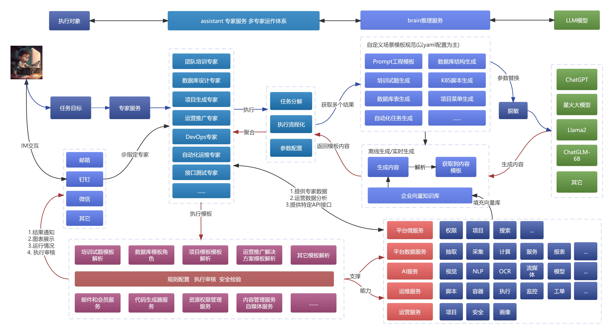

平台描述:

AIP Multi-Agent平台是一种综合性的能力，旨在将各种业务流程和任务集成、自动化和优化，以实现高效、精确和可靠的业务操作。超自动化通过结合人工智能、大数据、自动化工具和技术，将人类和机器的能力相结合，以实现全面的自动化。

## 平台设计预览

> 当前整体平台设计参考Aliyun/Aws/Coze等云平台

视频介绍<a href="//player.bilibili.com/player.html?isOutside=true&aid=113699092174355&bvid=BV1PwCuY1Eu5&cid=27481869143&p=1" target="_blank">AIP智能体平台项目介绍及体验方式</a>

这个是当前集成的UI设计和原型设计，同时也是后期的设计和实现内容及方向等。

<table>
  <tr>
    <td>
      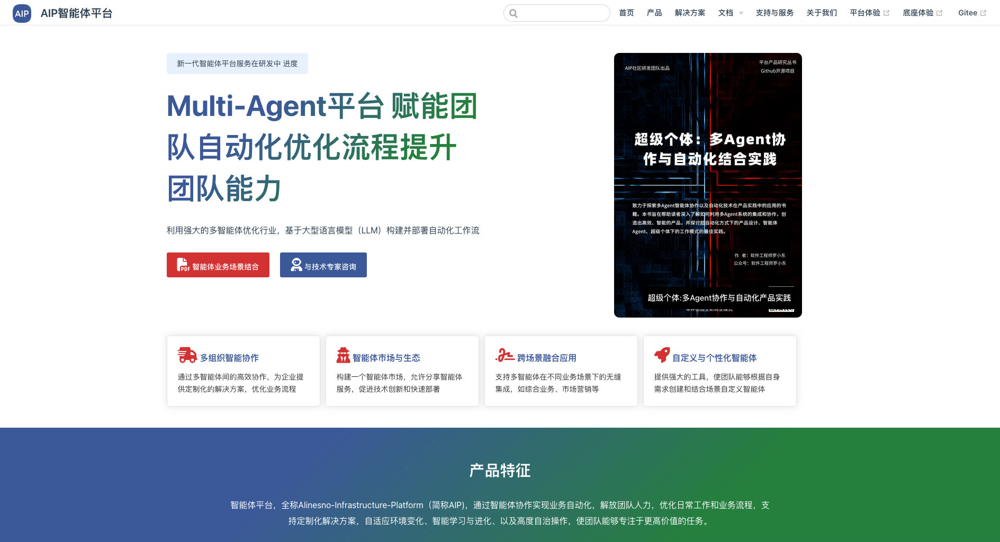
    </td>
    <td>
      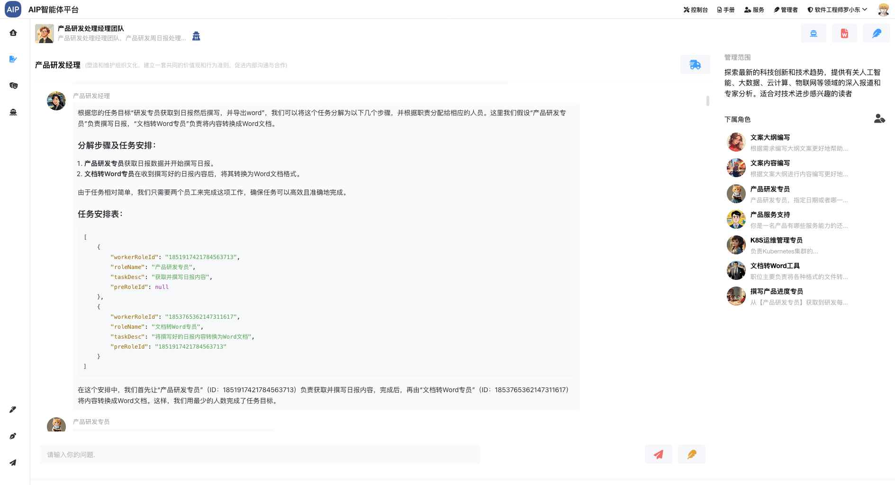
    </td>
  </tr>
  <tr>
    <td>
      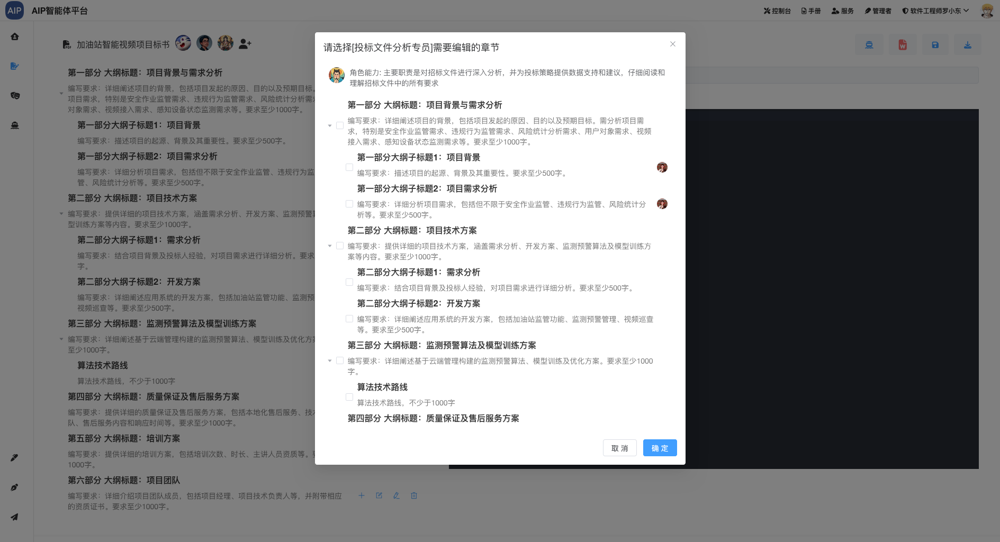
    </td>
    <td>
      
    </td>
  </tr>
  <tr>
    <td>
      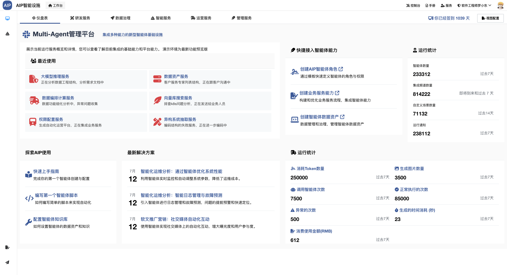
    </td>
    <td>
      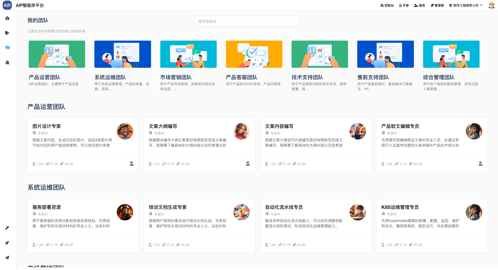
    </td>
  </tr>
  <tr>
    <td>
      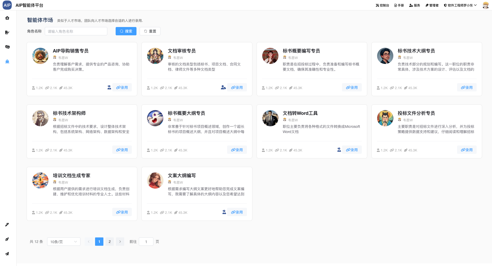
    </td>
    <td>
      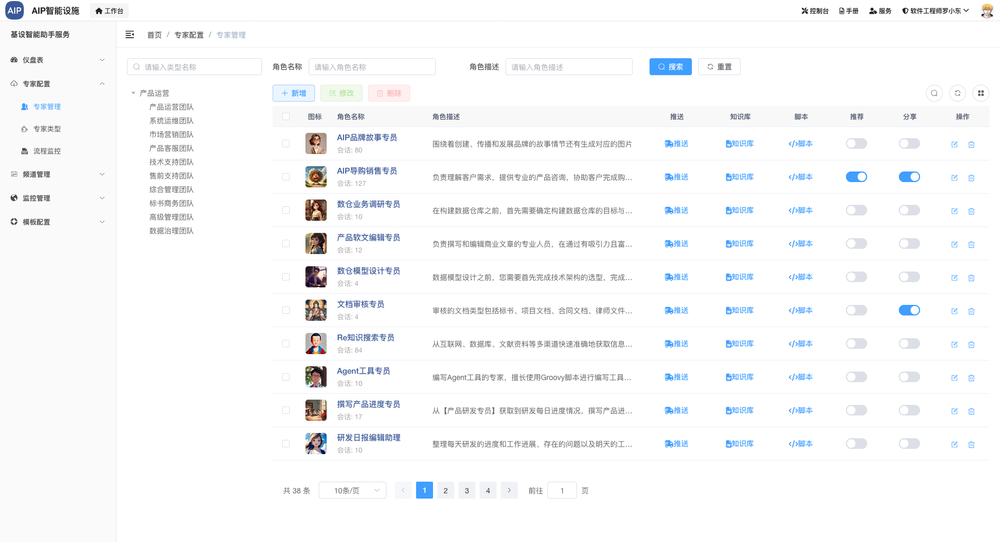
    </td>
  </tr>
  <tr>
    <td>
      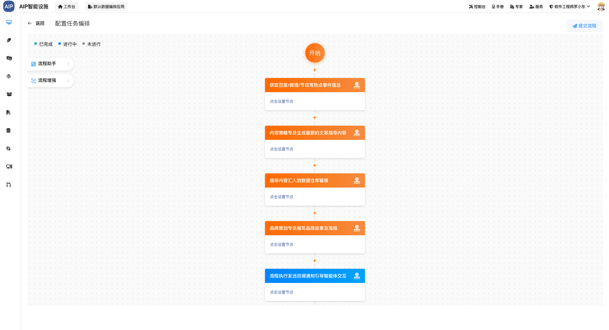
    </td>
    <td>
      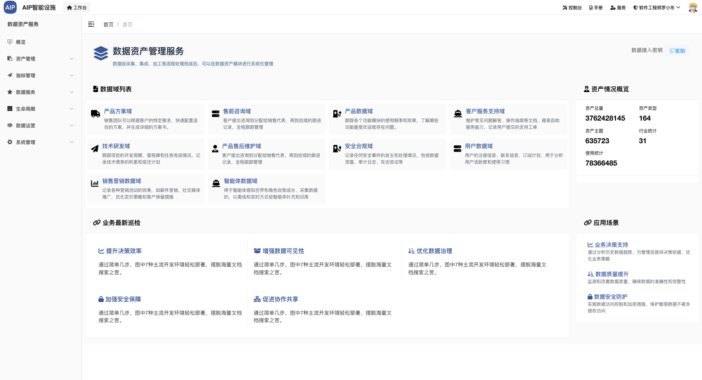
    </td>
  </tr>
  <tr>
    <td>
      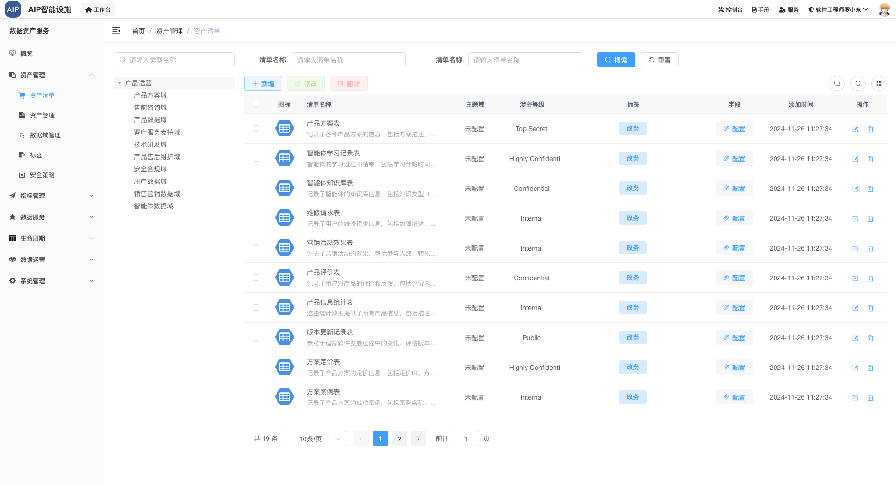
    </td>
    <td>
    </td>
  </tr>
</table>

## 鸣谢

- interpreter 部分参考了 [open-interpreter]() 项目的代码和思路。
- 多模型适配部分参考了 [Agents-Flex]() 项目的代码和思路，并做二次开发开发改造
- 前端部分集成了 [chatgpt-web](https://github.com/Chanzhaoyu/chatgpt-web)。
- 头像地址从[userpics](https://userpics.craftwork.design/) , 注:此不可商用
- 部分逻辑设计参考[FastGPT](https://github.com/labring/FastGPT)

## 注意

> 项目后期才会进一步剔除

- 当前项目包含有aspose-words的jar，商业使用请注意剔除【在下一版本剔除】